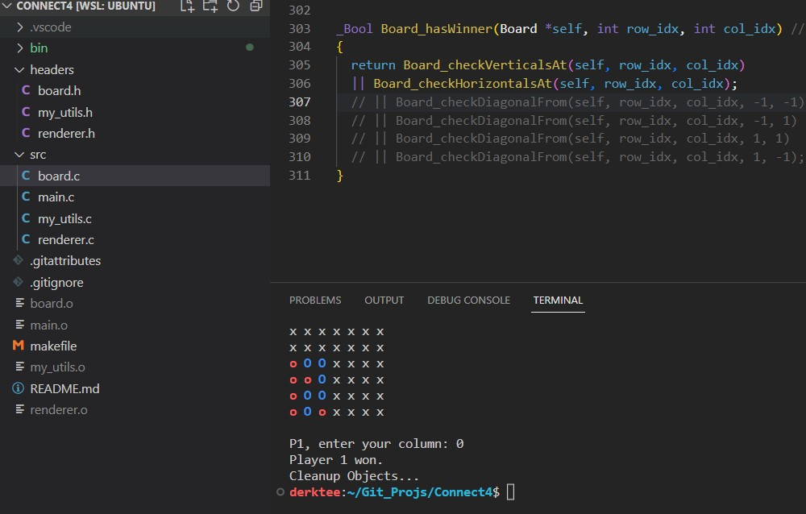

# Connect Four (Fork)
## By: DrkWithT, gskapoor (original author on GitHub)

### Screenshots:

### Summary:
This is a fully-blown fork of the original repo "connectFour" by _"gskapoor"_. The codebase here is for a console version of the popular Connect 4 game. However, there _might_ be a few bugs. I will work on this in my leisure time.

Winner checking logic is work in progress. The diagonal checker function is still being tested.

### Other Features:
 1. Colored Text!
  - Player 1 is red, Player 2 is blue, and the intro text is bright green!
 2. Automatically clears screen! 

### How To Run: (Only Linux / WSL / possibly MacOS)
 - Download / Clone this Repo. Move around this folder to wherever you'd like.
 - Run `make all` to build the program.
 - Enter `./bin/connect4` to run the program.
 - Enter `make clean` to remove the old executable between code edits.

### Other Notes:
The version of C used is _C11_ or above.
